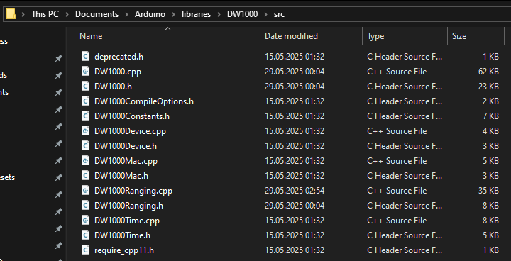
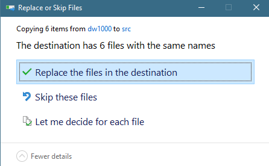

# Smart Clicker 2.0 Hardware Repo

This repository contains the Arduino UNO R4-bound firmware for the Smart Clicker 2.0 project, specifically for the Anchor and Clicker devices.

## Project Structure

- `anchor/`
  - Contains the firmware for the Anchor device, which acts as a fixed reference point in the UWB (Ultra-Wideband) positioning system.
  - Main code: `anchor/Anchor/Anchor.ino`

- `clicker/`
  - Contains the firmware for the Clicker device, a mobile unit that communicates with the Anchor for positioning and event tracking.
  - Main code: `clicker/Clicker/Clicker.ino`
  - Includes `secrets_template.h` for configuration of sensitive data (e.g., WiFi credentials, keys). Rename the file to `secrets.h` and fill in your values.

## Required Libraries

Make sure to install the following libraries in the Arduino IDE before uploading the firmware:

- `ArduinoHttpClient` by Arduino
- `ArduinoMqttClient` by Arduino
- `NTPClient` by Fabrice Weinberg
- `ArduinoJson` by Benoit Blanchon
- `Base64` by Xander Electronics
- `Crypto` by Rhys Weatherley
- `DW1000` by Thomas Trojer

You can install these libraries via the Arduino Library Manager.

### Additional setup for UWB

In order to get more accurate measurements and better device detection, a few changes have been made to the source files of the `DW1000` library. The modified files can be found under `dw1000/`, and they need to be copied in the Arduino libraries directory. The following picture depicts the correct folder's location on a Windows computer.

The modified files must be copied after installing the libraries using the Arduino IDE. 

When copying the files, the replace option should be selected.

## Getting Started

1. **Clone the repository** to your local machine.
2. **Install the Arduino IDE** and required libraries for Arduino UNO R4 development.
    - Copy the modified UWB files according to the instructions above.
3. **Configure secrets:**
    - **Clicker**
        - Rename `secrets_template.h` to `secrets.h`.
        - Fill in your WiFi credentials and any other required secrets.
        - Change `UWB_DEVICE_ID` in `Clicker.ino` according to the instructions in the comments.
    - **Anchor**
        - Change `UWB_DEVICE_ID` in `Anchor.ino` to the desired anchor ID. It should match the ID provided in the dashboard application
    - Change `UWB_NETWORK_ID` in both clicker and anchor code to the desired value. The value should be identical in both files.
4. **Open the `.ino` file** for the device you want to program (Anchor or Clicker) in the Arduino IDE.
5. **Select the correct board** (Arduino UNO R4) and port after plugging in your device.
6. **Upload the firmware** to your device.

## Contributors
- Andrei Niculescu
- Iasmina Huțupaș
- Mario Constantin
